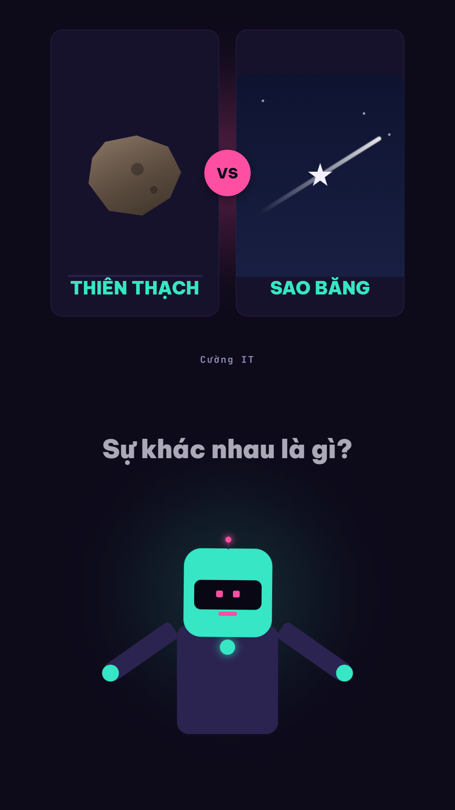
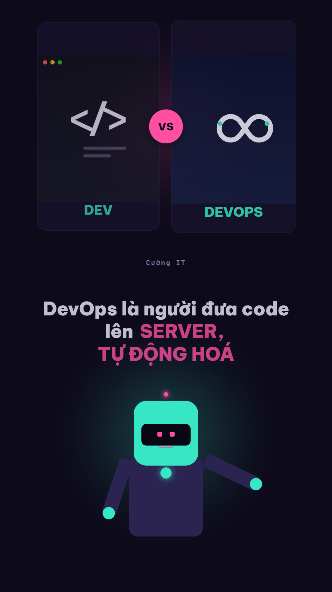

# Tạo Video Dạng So Sánh Kiến Thức — Comparison Video Template

**Template video giáo dục ngắn (TikTok/Reels/Shorts)** dựng trên **[HyperFrames](https://hyperframes.heygen.com)** — mỗi video so sánh một cặp khái niệm hay bị nhầm lẫn, theo đúng một layout/nhịp cố định, chỉ đổi nội dung.


## Mục lục

- [Xem trước](#-xem-trước)
- [Các video hiện có](#các-video-hiện-có)
- [Tính năng nổi bật](#-tính-năng-nổi-bật)
- [Bảng màu & thiết kế](#-bảng-màu--thiết-kế)
- [Cấu trúc repo](#-cấu-trúc-repo)
- [Yêu cầu hệ thống](#️-yêu-cầu-hệ-thống)
- [Bắt đầu](#-bắt-đầu)
- [Đóng góp](#-đóng-góp)
- [Xem thêm](#-xem-thêm)
- [License](#-license)

## 🎬 Xem trước

| Thiên thạch vs Sao băng | Dev vs DevOps |
| --- | --- |
|  |  |

Ảnh chụp trực tiếp từ composition hiện tại (`hyperframes snapshot`) — bảng màu tím-hồng-lục lam và avatar
mèo đen đeo kính 2D là giao diện **mặc định hiện hành** của cả series (xem [Bảng màu & thiết kế](#-bảng-màu--thiết-kế)).

Một số demo video ngắn dạng TikTok/Reels/Shorts đã xuất bản:

| Demo 1 | Demo 2 |
| --- | --- |
| [](https://www.youtube.com/shorts/PK-BZtdnkFU) | [](https://youtube.com/shorts/8ZfXTse5HFw) |
| ▶️ **[youtube.com/shorts/PK-BZtdnkFU](https://www.youtube.com/shorts/PK-BZtdnkFU)** | ▶️ **[youtube.com/shorts/8ZfXTse5HFw](https://youtube.com/shorts/8ZfXTse5HFw)** |

## Các video hiện có trong repo

| Video | Ngôn ngữ | Đặc điểm nhận diện & Linh vật | Thời lượng | Thư mục |
|---|---|---|---|---|
| **TCP vs UDP** | 🇺🇸 en | Flagship 68.1s (7 Hồi, 20 Nhịp), Cú Barnaby 🦉, BGM & 8 SFX cues | 68.1s | [`videos/tcp-vs-udp/`](videos/tcp-vs-udp/) |
| **Pilsner vs Weizen** | 🇩🇪 de | Chó xúc xích Otto 🐶, Nền vàng lúa mạch, Bia Đức | 35.2s | [`videos/pilsner-vs-weizen/`](videos/pilsner-vs-weizen/) |
| **Soju vs Makgeolli** | 🇰🇷 ko | Hổ K-Tiger Horangi 🐯, Nền xanh Celadon, Rượu Hàn | 38.8s | [`videos/soju-vs-makgeolli/`](videos/soju-vs-makgeolli/) |
| **Sushi vs Sashimi** | 🇯🇵 ja | Chó Shiba Hachi 🐕, Nền hoa anh đào, Mực tàu Torii | 37.8s | [`videos/sushi-vs-sashimi/`](videos/sushi-vs-sashimi/) |
| **Matcha vs Green Tea** | 🇺🇸 en | Cú Barnaby 🦉, Nền da dê ngà, Oxford Slate | 41.6s | [`videos/matcha-vs-green-tea/`](videos/matcha-vs-green-tea/) |
| **Alligator vs Crocodile**| 🇺🇸 en | Cú Barnaby 🦉, So sánh bò sát, Oxford Slate | 36.0s | [`videos/alligator-vs-crocodile/`](videos/alligator-vs-crocodile/) |
| **Crow vs Raven** | 🇺🇸 en | Cú Barnaby 🦉, "Crow caws, raven croaks" | 35.8s | [`videos/crow-vs-raven/`](videos/crow-vs-raven/) |
| **RAM vs ROM (Deutsch)** | 🇩🇪 de | Chó Otto 🐶, Bản tiếng Đức của RAM vs ROM | 39.9s | [`videos/ram-vs-rom-de/`](videos/ram-vs-rom-de/) |
| **RAM vs ROM** | 🇻🇳 vi | Mèo Mun 🐱, "RAM để chạy, ROM để nhớ" | 39.9s | [`videos/ram-vs-rom/`](videos/ram-vs-rom/) |
| **Dev vs DevOps** | 🇻🇳 vi | Mèo Mun 🐱, "Dev xây, DevOps vận hành" | 19.7s | [`videos/dev-vs-devops/`](videos/dev-vs-devops/) |
| **Thiên thạch vs Sao băng**| 🇻🇳 vi | Mèo Mun 🐱, Video đầu tiên của series | 17.0s | [`videos/thien-thach-vs-sao-bang/`](videos/thien-thach-vs-sao-bang/) |

## 📌 Tính năng nổi bật

- **Chuẩn hóa thời lượng 65s – 70s (7 Hồi, 20 Nhịp)**: Đạt điều kiện bật kiếm tiền TikTok Creator Rewards & YouTube Shorts dài, với kịch bản dồn dập, sắc bén và chuyển cảnh đạo diễn GSAP spotlight chuyên nghiệp.
- **Bản địa hóa 6 Quốc gia & Linh vật 2D độc quyền**:
  - 🇻🇳 Việt Nam: Mèo Mun Professor 🐱
  - 🇺🇸 Mỹ / Toàn cầu: Cú thông thái Barnaby 🦉
  - 🇩🇪 Đức: Chó xúc xích Otto 🐶
  - 🇫🇷 Pháp: Gà trống Pierre 🐓
  - 🇯🇵 Nhật Bản: Chó Shiba Hachi 🐕
  - 🇰🇷 Hàn Quốc: Hổ con Horangi 🐯
- **Multi-track Audio Engine (BGM & SFX)**: Tách bạch giữa nhạc nền ambient (18%), 8 hiệu ứng âm thanh tương tác đồng bộ nhịp (`whoosh`, `pop`, `ding`, `click`, `chime`) và giọng đọc Neural TTS (100%).
- **Web Studio & Bộ công cụ tự động hóa**:
  - **In-Studio Live Script Editor**: Chỉnh sửa kịch bản trực tiếp trên giao diện web, tự động retime và sinh lại giọng đọc.
  - **Social Publishing Kit**: Tự động sinh 3 tiêu đề viral, mô tả SEO kèm timestamps và 15+ hashtags hot trend.
  - **Cover Thumbnail 9:16**: Tạo ảnh bìa vector 1080×1920 giật gân thu hút CTR cao.
  - **1-Click Global Multi-Language**: Tạo đồng loạt 6 video cho 6 quốc gia từ 1 chủ đề duy nhất (`tools/batch-global.mjs`).
  - **Audio Soundboard**: Nghe thử BGM và SFX trực tiếp trên trình duyệt trước khi render.
  - **Direct MP4 Download**: Tải video đã render về máy tính chỉ với 1 click.

## 🎨 Bảng màu & thiết kế

Toàn bộ hợp đồng layout/màu/font/motion nằm trong [`DESIGN.md`](DESIGN.md) — mọi video trong series
đều phải theo đúng bảng màu và cấu trúc 3-zone này để giữ nhận diện đồng nhất.

| Token | Hex | Vai trò |
| --- | --- | --- |
| `--bg` | `#ECE6C2` | Nền chính (kem ấm) |
| `--panel` | `#6F5643` | Nền card minh hoạ (nâu đậm) |
| `--panel-edge` | `#D2A24C` | Viền card (vàng mustard) |
| `--fg` | `#6F5643` | Chữ chính trên nền kem |
| `--fg-on-panel` | `#ECE6C2` | Chữ kem trên card nâu |
| `--accent-terra` / `-ink` | `#CC6B49` / `#B4502F` | Cam đất — mảng màu / **chữ** từ khoá |
| `--accent-sage` / `-ink` | `#73BDA8` / `#3E8C77` | Xanh sage — mảng màu / **chữ** tên khái niệm |
| `--fur` | `#4A3A2C` | Mèo MC (thân, đầu, tai, chân, đuôi) |

## 📁 Cấu trúc repo

```
auto-compare-video/
├── README.md, LICENSE                ← bạn đang ở đây
├── CLAUDE.md, AGENTS.md               ← hướng dẫn cho AI coding agent (Claude Code, Cursor...)
├── DESIGN.md                          ← hợp đồng layout/màu/font/motion — dùng chung mọi video
├── vbee.md                            ← tài liệu API Vbee TTS
├── docs/previews/                     ← ảnh preview tĩnh dùng trong README
├── .env                                ← Vbee credentials dùng chung (tự tạo, không commit)
├── .claude/skills/create-video/       ← skill Claude Code: tạo video mới theo đúng template
├── .agents/skills/create-video/       ← skill Antigravity: cùng quy trình, cho Antigravity / Antigravity CLI
└── videos/
    ├── thien-thach-vs-sao-bang/       ← 1 video = 1 project HyperFrames độc lập
    │   ├── package.json, hyperframes.json, meta.json, index.html
    │   ├── BRIEF.md                    ← brief riêng của video này
    │   ├── assets/vo/*.mp3, durations.json
    │   ├── scripts/generate-vo.mjs
    │   └── renders/, snapshots/        ← output, không commit
    ├── dev-vs-devops/                 ← cấu trúc tương tự
    └── <video-mới>/                   ← thêm video mới vào đây
```

Mỗi video trong `videos/` là một project HyperFrames **hoàn toàn độc lập** (`npm run dev/check/render/publish` riêng), chỉ dùng chung `.env` ở root và bộ quy tắc thiết kế trong `DESIGN.md`.

## 🛠️ Yêu cầu hệ thống
1. **AI coding agent** (Claude Code, Cursor, Codex v.v.) để gọi skill tạo video tự động).
2. **TTS provider** (chọn 1 trong 2):
   - **[Vbee TTS](https://vbee.vn/?aff=cuongit96)** — chất lượng cao, nhiều giọng Việt, cần tài khoản (App ID + Access Token).
   - **[Edge TTS](https://github.com/travisvn/edge-tts-universal)** — miễn phí, không cần API key, giọng Microsoft Neural. Đã tích hợp sẵn qua npm (`edge-tts-universal`), không cần cài gì thêm.
3. **Node.js** ≥ 18 — tải tại [nodejs.org/en/download](https://nodejs.org/en/download)
4. **FFmpeg & FFprobe** trong `PATH` — cần để đo độ dài audio và render video. Hướng dẫn cài đặt: [ffmpeg.org/download.html](https://ffmpeg.org/download.html) (Windows có thể dùng `winget install ffmpeg` hoặc `choco install ffmpeg`; macOS dùng `brew install ffmpeg`; Linux dùng `apt install ffmpeg`)


## 🚀 Bắt đầu

### 1. Thiết lập credentials (dùng chung cho mọi video)

Copy `.env.example` thành `.env` ở **thư mục gốc của repo**, rồi điền các biến môi trường:

```bash
cp .env.example .env
```

```env
TTS_PROVIDER=edge                    # "edge" (miễn phí) hoặc "vbee" (cần tài khoản, chỉ giọng Việt)
EDGE_VOICE_EN=en-US-AndrewNeural     # giọng tiếng Anh (mặc định của series)
EDGE_VOICE_DE=de-DE-ConradNeural     # giọng tiếng Đức
CHANNEL=Cường IT                     # tên kênh hiển thị trên eyebrow tag
AUTO_CREATE_VIDEO=0                  # 0 = xác nhận từng bước | 1 = chạy tự động
```

> **Mặc định dùng Edge TTS (miễn phí)** — chạy hoàn toàn bằng Node.js (qua [`edge-tts-universal`](https://github.com/travisvn/edge-tts-universal)), không cần Python hay API key. Muốn dùng Vbee TTS (chất lượng cao hơn): đổi `TTS_PROVIDER=vbee` và thêm `VBEE_APP_ID`, `VBEE_ACCESS_TOKEN`, `VBEE_VOICE_CODE` — xem `.env.example` để biết đầy đủ.

`.env` không commit (đã có trong `.gitignore`) — chỉ `.env.example` được đưa lên repo làm mẫu.

### 2. Tạo video mới

Cách nhanh nhất — dùng **Claude Code**, gọi skill có sẵn kèm cặp khái niệm muốn so sánh, ví dụ:

```
/create-video Dev và DevOps
```

Chỉ cần lệnh này là skill tự động làm hết phần còn lại: hỏi/xác nhận lại cặp khái niệm + kịch bản
12 dòng (trừ khi `AUTO_CREATE_VIDEO=1` — xem bước 1), tự khởi tạo project, sinh giọng đọc VO, dựng
composition đúng theo `DESIGN.md`, và chạy `npm run check` — xem chi tiết trong
[`.claude/skills/create-video/SKILL.md`](.claude/skills/create-video/SKILL.md).

**Dùng Google Antigravity?** Skill tương đương đã có sẵn ở
[`.agents/skills/create-video/`](.agents/skills/create-video/) — clone repo về là Antigravity tự
nhận, không cần cài gì. Không cần gõ tên skill, chỉ cần nói bình thường:

```
Làm video so sánh Dev và DevOps
```

### 2b. Tự động tạo chủ đề (Auto Topic Generation)

Repo tích hợp sẵn bộ tạo chủ đề tự động (100% offline, không cần API key) kèm 12 nhịp kịch bản và SVG icons:

**1. Qua dòng lệnh (CLI):**

```bash
# Xem danh mục và danh sách chủ đề có sẵn (Anh, Đức, Nhật, Hàn, Đời sống, Tự nhiên, Khoa học)
npm run topic -- --list

# Lọc theo thị trường: culture_uk | culture_de | culture_jp | culture_kr
npm run topic -- --category culture_jp

# Tìm kiếm chủ đề theo từ khoá
npm run topic -- --query "sushi"

# Tự động chọn chủ đề và tạo video trọn gói từ A-Z (kèm render MP4)
npm run topic:create -- --category culture_uk --target 36 --render
```

Hoặc qua `create-video.mjs`:
```bash
node tools/create-video.mjs --auto-topic [--category culture_jp] [--target 36] [--render]
```

**2. Qua giao diện Compare Studio:**

```bash
npm run studio
```
Mở trình duyệt tại `http://localhost:4321`, bấm nút **"Tạo video mới"** ở góc trên hoặc thanh bên trái để chọn/đổi chủ đề ngẫu nhiên, xem trước kịch bản 12 dòng và tạo video trực tiếp với log stream thời gian thực.

Không dùng AI agent nào ở trên, hoặc muốn tự chạy từng bước thủ công — làm theo phần dưới đây:

<details>
<summary>Các bước thủ công (không dùng skill)</summary>

**Sinh giọng đọc cho một video:**

```bash
cd videos/thien-thach-vs-sao-bang
node scripts/generate-vo.mjs
```

Tải audio về `assets/vo/*.mp3` và ghi độ dài thật vào `assets/vo/durations.json`.

**Preview / kiểm tra / render:**

Mọi lệnh chạy với thư mục hiện tại là **thư mục video** (vì `package.json` nằm ở đó):

```bash
cd videos/thien-thach-vs-sao-bang
npm run dev       # preview server (long-running)
npm run check     # lint + layout + motion + contrast
npm run render    # render ra renders/*.mp4
npm run publish   # xuất bản, lấy link chia sẻ
```

**Tạo video hoàn toàn mới (thay vì lặp lại video có sẵn):**

1. Tạo thư mục mới `videos/<ten-video-moi>/`, chạy `npx hyperframes@latest init` bên trong.
2. Copy cấu trúc HTML/CSS/timeline từ một video có sẵn, giữ nguyên hợp đồng layout trong `DESIGN.md` — chỉ đổi nội dung/icon/audio theo chủ đề mới.
3. Viết `BRIEF.md` riêng cho video đó (chủ đề, góc so sánh, kịch bản).
4. `node scripts/generate-vo.mjs` rồi `npm run check` trước khi coi là xong.

</details>

## 🎛️ Compare Studio (bảng điều khiển local)

Quản lý cả series bằng giao diện web chạy trên máy: xem danh sách video, phát bản render,
đọc kịch bản 12 dòng kèm timing, và bấm chạy `check` / `render` / sinh lại VO với log trực tiếp.
Studio chỉ xem và chạy lệnh; tạo video mới thì làm qua chat với AI agent (xem phần trên).

```bash
cd studio && npm install && npm start   # http://localhost:4321
```

Chi tiết: [`studio/README.md`](studio/README.md). Chỉ dùng localhost, không có xác thực.

## 🤝 Đóng góp

Repo mở cho việc nhân bản/tuỳ biến. Nếu thêm video mới hoặc sửa template, giữ đúng layout 3-zone cố định trong `DESIGN.md` (đây là "hợp đồng" giúp cả series đồng nhất) — mọi thay đổi khác (chủ đề, kịch bản, icon) đều được hoan nghênh. Mở PR hoặc issue nếu bạn tìm thấy lỗi hoặc muốn đề xuất cải tiến.

## 🔗 Xem thêm

Xem các mẫu tạo video khác tại:

- Link repo tạo video từ 1 đường Link/Bài viết: 🔗 [github.com/Cuongyd196/auto-video-gen](https://github.com/Cuongyd196/auto-video-gen)
- 1 repo tương tự sử dụng Remotion: 🔗 [github.com/Cuongyd196/remotion-cuongit-template](https://github.com/Cuongyd196/remotion-cuongit-template)

Các video mẫu mình đã làm, các bạn có thể xem trong Reels hoặc TikTok:

- 📹 Facebook: [www.facebook.com/cuongit96/reels/](https://www.facebook.com/cuongit96/reels/)
- 📹 TikTok: [www.tiktok.com/@cuongit96](https://www.tiktok.com/@cuongit96)

Mình tạo nhóm này cho các bạn trao đổi về Làm Video với AI nhé.
Với các repo mình công khai, có vướng mắc mình sẽ giải đáp cho các bạn.

- 👥 Nhóm trên Facebook: [facebook.com/groups/1010029065373486](https://www.facebook.com/groups/1010029065373486/)
- 👥 Nhóm trên Zalo: [zalo.me/g/8bfeotyh5ewtkzxmp5gt](https://zalo.me/g/8bfeotyh5ewtkzxmp5gt)

Nếu hữu ích với các bạn thì cho mình 1 star GitHub nhé 🌟

Nếu muốn ủng hộ mình 1 ly cà phê: [buymeacoffee.com/cuongit96/gallery/4959449](https://buymeacoffee.com/cuongit96/gallery/4959449)

## 📄 License

[MIT](LICENSE) — tự do dùng, sửa, phát hành lại, chỉ cần giữ thông báo bản quyền.
