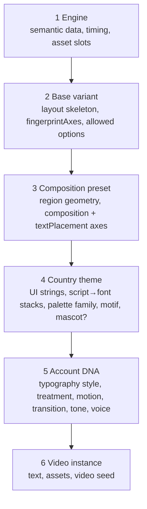
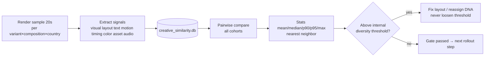

# MATRIX VARIANT SYSTEM V2 — Creative Identity System cho ~202 TikTok accounts

> Thay thế phần kiến trúc của `docs/PLAN_video_variants.md` (V1). V1 vẫn là nguồn sự thật về **mục tiêu sản phẩm**
> (10 engine, danh mục concept, Antigravity là nguồn ảnh chính, sản xuất trước – đăng sau). Tài liệu này là nguồn sự
> thật về **kiến trúc triển khai**.
>
> Ngày: 26/09/2026. Trạng thái: V2 đã tự review (mục 22). Phase 0 được phép triển khai; Phase ≥ 1 chờ duyệt.
> Người đọc: chủ dự án + các coding agent (Claude Code / Codex / Gemini). Đọc kèm `AGENTS.md`,
> `compare_studio/matrix/render/engines/README.md`.

---

## 1. Executive summary

- **Vấn đề gốc:** TikTok gắn cờ "trùng lặp" và bóp tầm với các acc dùng chung một khuôn hình. Hiện 237 kênh Matrix chỉ có
  4 bảng màu, 2 style, và gần như 1 giọng/ngôn ngữ; một số engine giống nhau 54–100% khung hình giữa các video.
- **V1** đề xuất 102 renderer độc lập và ràng buộc `(country, variant)` duy nhất. Cách này **không đủ chỗ** (DE có 125 acc)
  và khó bảo trì.
- **V2** xây một *Creative Identity System* 6 tầng:
  `engine → base variant → composition preset → country theme → account Creative DNA → video instance`.
  - Mỗi engine có khoảng 6–8 base variant mạnh (tổng khoảng 70–75); mỗi variant có 2–4 composition preset dựng tay,
    khác nhau về cấu trúc.
  - Ra khoảng 200+ "structural identity" (variant × composition). DNA chọn thêm typography / treatment / motion /
    transition / tone từ các catalog có giới hạn, và có version.
- **Khác biệt đo được:** trục khác biệt (`fingerprintAxes`) viết thành code, validator chặn 2 variant quá giống nhau.
  Đo video bằng nhiều tín hiệu (visual, layout, motion, timing, color, asset, audio). Ngưỡng chỉ là
  **internal diversity threshold**, không phải bảo đảm "an toàn với TikTok".
- **Tái lập được:** DNA tất định (seed từ `channel_id + variant_id + dna_version`), lưu trong YAML kênh, có
  `dna_version` / `variant_version` / `kit_version`. Mỗi render ghi đủ cấu hình vào `meta.json`.
- **Tương thích ngược:** kênh không có `creative.variant_id` chạy đúng đường cũ. Có cờ tắt toàn cục `MATRIX_VARIANTS=0`.
- **Rollout từng bước:** Phase 0 dựng khung + 1 variant tham chiếu → Phase 1 mystery → … → canary theo nhóm, có đường rollback.

## 2. Vấn đề trong PLAN V1

| # | Vấn đề | Hệ quả | V2 xử lý |
|---|---|---|---|
| P1 | Ràng buộc `(country, variant_id)` duy nhất, trong khi DE có 125 acc > 102 variant; niche còn giới hạn thêm engine dùng được | Không gán được, hoặc phải đẻ thêm renderer | Structural identity = variant × composition (khoảng 200+), duy nhất trong mỗi nước; các trục DNA khác làm lớp khác biệt thứ hai (mục 5, 11) |
| P2 | 102 renderer độc lập, 500–1000 dòng/cái | Bảo trì nặng, copy-paste | 70–75 base variant + composition preset + primitive dùng chung (mục 4.4) |
| P3 | Luật "4/6 trục" chỉ ghi trong Markdown | Không ai kiểm | `fingerprintAxes` + `compareVariantAxes` trong code, test chặn (mục 6) |
| P4 | Chỉ đo khung hình, ngầm hiểu "<30% = an toàn" | Kết luận sai, thiếu tín hiệu layout/motion/timing | Đo đa tín hiệu, gọi là internal diversity threshold, báo thống kê + nearest neighbor (mục 10) |
| P5 | Topic gắn 1:1 với variant qua `topic_brief` | Cạn chủ đề sau vài trăm video; lệch niche | Topic Pack tách khỏi variant, có trọng số (mục 7) |
| P6 | "Mỗi acc một giọng" | DE chỉ có 9 giọng thật (6 Edge + 3 CapCut) cho 125 acc | Voice DNA = giọng + rate + pitch + fx, ưu tiên đa dạng chứ không đòi duy nhất; có CapCut (mục 8) |
| P7 | Thứ tự trộn theme nước với variant không rõ | Mỗi renderer tự trộn một kiểu | Bảng quyền sở hữu khoá theo tầng + `resolveCreativeContext` (mục 4.3) |
| P8 | Không có version, observability, migration an toàn | Không trả lời được "video này render bằng cấu hình nào" | `dna_version`, `renderer_version`, block `meta.creative`, migration có kế hoạch + backup (mục 12, 19) |
| P9 | Làm xong hết rồi mới đo chi phí và thử production | Rủi ro dồn về cuối | `costProfile` từ Phase 0, canary theo nhóm (mục 14, 15) |
| P10 | V1 ghi cứng "bật nhãn AI là việc cấm" | Biến sở thích hiện tại thành ràng buộc kiến trúc | Setting `auto｜on｜off`; giá trị production hiện tại = `off` theo chỉ thị chủ dự án (conflict ghi ở mục 2.1) |
| P11 | Sổ cái stock chỉ lưu clip id | Không phát hiện cùng footage ở provider khác | Ledger V2 có sha256 + phash + đoạn đã dùng (mục 9.3) |
| P12 | Survival: 1 reactor/variant, chưa cân nhắc chi phí và độ đa dạng | — | Reactor theo (variant, country), vẽ một lần (mục 9.4) |
| P13 | Nhiều concept giữa các engine gần giống nhau (ô cửa tàu ngầm ×3, CCTV ≈ VHS, bảng phấn ×2…) | Khác engine nhưng layout giống → vẫn có thể bị gắn cờ | Bảng review concept (mục 20), đổi hoặc gộp trước khi làm |

### 2.1 Conflict phải ghi lại (không tự chọn)

| Conflict | Bên A | Bên B | Đề xuất |
|---|---|---|---|
| Nhãn AI khi đăng | Chỉ thị V2: setting `auto｜on｜off`, mặc định kiến trúc `auto` | Chỉ thị chủ dự án 26/09 (memory `tiktok-ai-label-off`): **không bật** | Làm setting 3 giá trị; **production đặt `off`** cho tới khi chủ dự án đổi; `auto` chỉ gợi ý (ghi vào manifest), không tự bật. Không nằm trong Phase 0 |
| Compare không được niche nào cho phép (điểm < `minimum_score` 0.55), chỉ vào qua `topicEngine` | V1: 10 variant compare | `compatibility_matrix.yaml` | Variant khai `compatibility.niches` rõ ràng, validator chấp nhận khi niche nằm trong danh sách đã duyệt; chủ dự án duyệt danh sách ở Phase 4 |
| `kinetic` bị bỏ nhưng nhiều YAML có `kinetic` trong `preferred_engines` | V1 | YAML hiện tại | Acc có variant không bao giờ dùng kinetic; YAML legacy giữ nguyên tới khi gán DNA |

## 3. Vấn đề trong code hiện tại (đã kiểm chứng)

| # | Vấn đề | Bằng chứng | Ảnh hưởng tới V2 |
|---|---|---|---|
| C1 | **Renderer phụ thuộc mạng lúc render**: GSAP qua CDN (3.12.5 ở mystery/folklore, 3.14.2 ở newspaper/compare) và Google Fonts | `tools/create-mystery-video.mjs:308-311`, `create-newspaper-video.mjs:239-242`, `create-folklore-video.mjs:491-494`, `engines/compare.mjs:390` | Variant **bắt buộc** dùng GSAP và font local (kit chép vào `assets/kit/`). Engine legacy giữ nguyên (không nằm trong phạm vi) |
| C2 | **Phiên bản HyperFrames trôi**: `package.json` của video ghim `0.7.58`, nhưng `renderNativeProject` cài + `upgrade` + `check` bằng `hyperframes@latest` | `native-engine-adapter.mjs:517-519, 628-648`; survival hỏng khi lên 0.8.78 (StaticGuard) | Ghi phiên bản HyperFrames thật vào `renderer_version`; đề xuất ghim bằng `MATRIX_HYPERFRAMES_SPEC` (cần duyệt vì ảnh hưởng legacy) |
| C3 | **Đổi engine âm thầm**: `resolveChannelsForTopic` → `topicEngine` (ép compare cho topic "A vs B") → `pickEngine` → `fallbackEngine()` | `template-selector.mjs:26` | Kênh có variant: engine khoá theo variant, bị chặn thì **không lùi** (bỏ qua kênh, ghi log) |
| C4 | Loại asset cố định theo engine ở 3 chỗ | `visual-director.mjs ENGINE_DEFAULTS`, `native-engine-adapter.mjs IMAGE_ENGINES/usesSceneImages`, `hashJobInputs` (science) | Variant khai `assetProfile`; Phase 0 chỉ cho phép variant dùng đúng asset type của engine (không phá hash); override thật ở Phase 1 |
| C5 | Schema kênh `additionalProperties:false`; validator đòi mỗi niche ≥ 10 kênh; `config_version` chỉ bị kiểm khi sync DB (`bkt_web/matrix_config.py:78-82`); app **tự sửa YAML trên VPS** (`channels.apply_language_to_channel_config`, `auto_link_channels`) | — | Mở rộng schema (optional field); migration phải khoá các bộ ghi YAML khác (mục 12). Hôm nay 237/237 YAML ở repo = VPS |
| C6 | Giọng: `voices.mjs` chỉ khai 2 Edge/ngôn ngữ + 24 CapCut; validator từ chối giọng không có trong `voices.mjs`; `audioRenderKey` chưa có `fx`; `synthesizeAudio` (đường Studio) tự đổi giọng khi lỗi | `voices.mjs:150-200`, `audio-orchestrator.mjs:35` | Catalog giọng mới từ nguồn thật (mục 8); Matrix vẫn dùng `createVoiceSynthesizer` (ném lỗi, không đổi giọng) |
| C7 | Fingerprint chỉ có pHash khung + khung trung bình + audio + md5 nhạc nền + giọng; trọng số `score()` tuỳ ý | `bkt_web/video_fingerprint.py:253-282` | Giữ làm tín hiệu `visual`/`audio` v1; thêm registry tín hiệu (mục 10) |
| C8 | `tools/themes` gồm bảng màu + HTML/CSS linh vật đặt tuyệt đối (`top:1280px`), gắn chặt layout compare; không có font theo hệ chữ | `tools/themes/index.mjs` | Kit theme chỉ lấy **họ màu + linh vật**; font theo hệ chữ nằm ở kit (mục 4.3) |
| C9 | `applyMatrixLayoutFixes` co chữ theo id cố định (`#story-content`, `#live-punchline`) | `native-engine-adapter.mjs:91` | Variant dùng `kit/fit` theo thuộc tính `data-fit` |
| C10 | Compare trộn logic (tách A/B, luật hiệp, fallback) với trình bày trong một file 637 dòng | `engines/compare.mjs` | Tách model/view ở Phase 4 |
| C11 | Font CJK không có trong repo; VPS có `Noto Serif CJK JP/KR` hệ thống (201 font) | `fc-list` trên VPS | Kit khai font stack local; kiểm font tồn tại trước khi render (Phase 1) |
| C12 | Survival dùng mặt Mr. Incredible (IP bên thứ ba) | `shared/assets/survival/mrincredible/` | Reactor gốc (mục 9.4) |
| C13 | `tools/find-image.mjs` có cả Pollinations (bị cấm trong pipeline video) | đầu file | Chỉ được gọi phần Wikimedia (`searchWikiImages`) |

## 4. Architecture V2

### 4.1 Pipeline render

```mermaid
flowchart LR
  subgraph Plan[Autopilot / batch-matrix]
    TP[Topic Pack pick] --> S[Script + TTS timing]
  end
  S --> SEL{channel.creative.variant_id?}
  SEL -- no --> LEG[Legacy engine path\nunchanged]
  SEL -- yes --> REG[Variant registry\ngetVariant]
  REG --> RES[resolveCreativeContext\nengine→variant→composition→country→DNA→video]
  RES --> AST[Asset strategy\nscope + fallback chain]
  AST --> HTML[variant.renderer.buildHtml ctx]
  HTML --> LINT[kit lint + duplicate ids + fit]
  LINT --> HF[HyperFrames check/render\n(pinned version recorded)]
  HF --> QA[Video QA + meta.creative]
  QA --> FP[Similarity signals]
  LEG --> HF
```

### 4.2 Registry và file layout

```
compare_studio/matrix/render/variants/
  index.mjs            # registry: listVariants, getVariant, validateRegistry, getVariantsForCountry, getVariantCreativeCapacity
  schema.mjs           # AXES, validateVariant, effectiveAxes, compareVariantAxes, MIN_AXIS_DIFF
  dna.mjs              # DNA_VERSION, validateDna, normalizeDna, dnaSignature, structuralKey, accountSeed, videoSeed, dnaOptions
  kit/
    VERSION.mjs        # KIT_VERSION
    profiles.mjs       # catalog có version: typography, treatment, motion, transition, tone
    theme.mjs          # theme nước: họ màu, hệ chữ, font stack, motif, chữ UI, linh vật (tuỳ chọn)
    resolve.mjs        # resolveCreativeContext (thứ tự trộn cố định)
    rng.mjs            # PRNG có seed (mulberry32) — không Math.random
    runtime.mjs        # chép GSAP + font local vào assets/kit/, sinh <script>/<link> local
    fit.mjs            # co chữ theo data-fit (xác định)
    lint.mjs           # mẫu cấm: Math.random, Date.now, http(s) URL, animate .clip opacity/autoAlpha, rAF loop
    primitives.mjs     # PhotoFrame, CaptionBlock, Overlay, … (HTML/CSS thuần)
  mystery/index.mjs … science/index.mjs   # mỗi engine export mảng variant (agent của engine sở hữu)
  mystery/reference-dossier.mjs          # variant tham chiếu Phase 0 (assignable:false)
compare_studio/tools/list-variants.mjs    # JSON cho Python (registry + profiles + voice catalog)
compare_studio/tools/preview-variants.mjs # dựng HTML mẫu mọi variant × composition × nước
compare_studio/tools/variant_contact_sheet.py # chụp 0.2/0.5/0.8 bằng Playwright, ghép contact sheet có nhãn DNA
bkt_web/autopilot/creative_dna.py         # gán DNA: dry-run (Phase 0), apply (Phase 6)
```

### 4.3 Thứ tự trộn và quyền sở hữu khoá

Mỗi tầng chỉ được đặt các khoá **nó sở hữu**. `kit/resolve.mjs` là nơi duy nhất trộn; renderer chỉ đọc
`ctx.creative`, không tự đọc theme hay YAML.



| Khoá | Tầng sở hữu | Ghi chú |
|---|---|---|
| `timing`, `extras` (dữ liệu ngữ nghĩa) | Engine | Không variant nào được đổi thời gian cảnh |
| `layoutFamily`, `slots`, `fingerprintAxes` gốc | Base variant | |
| `composition`, `textPlacement`, geometry vùng | Composition preset | Ghi đè 2 trục này của variant |
| `ui` (chữ giao diện), `script`, `fontStacks`, `paletteFamily`, `motif`, `mascot` | Country theme | Theme **không** đổi bố cục |
| `typography` (style trừu tượng → font stack của hệ chữ), `treatment`, `imageMotion`, `transition`, `tone` | Account DNA | Chỉ chọn trong danh sách `allowed` của variant |
| Nội dung, asset, seed video | Video | |

### 4.4 Primitive dùng chung — không phải "một template đổi biến CSS"

`kit/primitives.mjs` chỉ chứa khối nhỏ (PhotoFrame, CaptionBlock, Overlay: FilmGrain / PaperTexture / VHS / Halftone,
LowerThird, ProgressMeter, MapPin, Timeline). **Bố cục do composition quyết định**, không do primitive quyết định.
Luật review: nếu hai variant giống nhau > 60% mã HTML/CSS (đo bằng diff) thì hoặc tách primitive, hoặc là cùng một
variant (hai composition). Mỗi file variant đặt mục tiêu ≤ 300 dòng.

## 5. Creative DNA model

```yaml
creative:
  preferred_engines: [mystery]      # đúng 1 engine = engine của variant
  variant_id: mystery/case-file
  dna:
    dna_version: 1
    variant_version: 1
    composition: hero_evidence       # 1 trong compositions của variant
    typography: typewriter           # style trừu tượng; font thật theo hệ chữ của nước
    treatment: sepia_grain
    image_motion: ken_burns_slow
    transition: folder_flip
    tone: 2                          # 0..5 — dịch sắc độ trong họ màu của nước
```

- **Bounded:** mỗi trục chọn trong `variant.allowed.<axis>` (2–4 giá trị). Số tổ hợp của một variant là tích các
  danh sách, được biết trước (`getVariantCreativeCapacity`).
- **Structural key** = `variant_id#composition`. **Luật cứng:** duy nhất trong một nước.
- **Signature** = sha256 của JSON chuẩn hoá
  `{dna_version, variant_id, variant_version, composition, typography, treatment, image_motion, transition, tone, country}`.
  Cùng cấu hình thì ra cùng signature; khác một trục thì khác signature.
- **Seed:** `accountSeed = u32(sha256(channel_id|variant_id|dna_version))`; `videoSeed = u32(sha256(accountSeed|video_slug))`.
  Mọi thứ "ngẫu nhiên" (lệch giấy, xoay polaroid, hạt nhiễu, rung máy) lấy từ `kit/rng.mjs` với các seed này.
- **Không random lúc chạy.** DNA sinh một lần khi gán, lưu trong YAML; render chỉ đọc lại.
- **Version:**
  - `dna_version` đổi khi schema DNA đổi.
  - `variant_version` đổi khi layout của variant đổi đến mức nhìn khác. Video cũ vẫn ghi version cũ trong `meta.creative`.
  - `KIT_VERSION` đổi khi primitive hoặc profile đổi hình.

## 6. Variant schema

```js
export default {
  id: "mystery/case-file",          // "<engine>/<slug>", không đổi sau khi gán
  version: 1,                        // variant_version
  engine: "mystery",
  name_vi: "Hồ sơ vụ án",
  status: "active",                  // "active" | "reference" | "draft"; chỉ "active" được gán cho acc
  contentProfile: {
    topicPacks: { cold_case: 0.5, missing_person: 0.3, unexplained_evidence: 0.2 },  // tổng = 1
  },
  visualProfile: {
    layoutFamily: "dossier",
    fingerprintAxes: {              // 6 trục bắt buộc, giá trị từ vocabulary trong schema.mjs
      composition: "folder_card", textPlacement: "bottom", background: "wood_paper",
      transition: "page_turn", imageMotion: "ken_burns", typography: "typewriter",
    },
    compositions: {                 // 2–4 preset, mỗi preset đổi composition (+ thường textPlacement)
      hero_evidence: { axes: { composition: "hero_image", textPlacement: "bottom" }, describe: "..." },
      evidence_strip: { axes: { composition: "split_vertical", textPlacement: "right" }, describe: "..." },
    },
    allowed: {                      // lựa chọn cho DNA (id trong kit/profiles.mjs)
      typography: ["typewriter", "serif"], treatment: ["sepia_grain", "paper_texture"],
      image_motion: ["ken_burns_slow", "push_in"], transition: ["page_turn", "cut"], tone: [0, 1, 2, 3],
    },
    slots: { mascot: false },
  },
  audioProfile: { gender: "any", fx: ["none"], rate: [0.95, 1.0], pitch: [-1, 0] },
  assetProfile: {
    type: "IMAGE_AI",               // Phase 0: phải trùng asset type của engine
    perScene: 1, aspect: "9:16", scope: "SCENE",
    fallback: ["reuse_account_cache", "fail"],   // chuỗi được phép; mục 9.2
  },
  costProfile: { aiImagesPerScene: 1, stockClipsPerScene: 0, reusableAssetRatio: 0 },
  compatibility: { countries: ["en", "de", "ja", "ko"], scripts: ["latin", "ja", "ko"], niches: null }, // null = theo compatibility_matrix
  renderer: { buildHtml, compositionId },
  sample,                            // (lang) → dữ liệu mẫu cho preview/test, không cần TTS/ảnh thật
};
```

**Trục và luật (code: `schema.mjs`):**

- 6 trục: `composition`, `textPlacement`, `background`, `transition`, `imageMotion`, `typography`, mỗi trục có vocabulary cố định.
- `effectiveAxes(variant, compositionId, dna?)` = trục gốc ← composition ghi đè ← DNA (transition / imageMotion / typography).
- `compareVariantAxes(a, b)` trả về số trục khác nhau và danh sách trục trùng.
- **Luật cứng (test):**
  - Hai base variant cùng engine khác nhau ≥ **4/6** trục gốc.
  - Hai composition trong cùng variant khác nhau ≥ **2/6** trục, trong đó bắt buộc có `composition`.
  - Khác engine: cảnh báo (không chặn) khi khác < 3/6 trục, để review cross-engine (mục 20).

## 7. Topic Pack schema

`compare_studio/config/topic_packs/<id>.yaml`:

```yaml
id: cold_case
niche_id: unsolved_mysteries
brief: "Unsolved criminal cases with documented evidence, no living private individuals"
format: free            # free | versus | ranking
languages: [en, de, ja, ko]
countries: [GB, DE, JP, KR]
subject_constraints: { max_same_subject_days: 3, forbid: ["living private individuals"] }
seed_file: topics/packs/cold_case.txt
```

- Variant → nhiều pack có trọng số. Planner bốc pack theo trọng số với seed `(channel_id, plan_date)`, xác định, rồi bốc topic
  trong pack. Vẫn giữ luật `same_subject` giữa các acc cùng pack/niche.
- `format: versus` → validator dùng `splitSubjects` (compare). `format: ranking` → phải khớp dạng "Ranking every X" / "tier list of X".
- Gemini viết thêm topic theo `brief` của pack (như `autopilot/topics.py` hiện tại, nhưng theo pack).
- Niche của acc vẫn quyết định safety/hashtag; pack phải cùng niche, hoặc có trong danh sách niche của variant đã được duyệt.

## 8. Voice model (Voice DNA)

- **Catalog giọng thật** (`tools/list-variants.mjs --voices`):
  - Edge: snapshot từ `edge-tts-universal.listVoices()` (26/09): en-US 17, en-GB 5, de-DE 6, ja-JP 2, ko-KR 3.
  - **CapCut** (bắt buộc dùng, memory `capcut-tts-voice-pool`): `tools/capcut_tts_api/Voice.json` có 129 giọng
    (en-US 40, ja-JP 19, de-DE 3, ko-KR 0).
  - Trạng thái mỗi giọng: `registered` (có trong `voices.mjs`, validator nhận), `candidate` (chưa đăng ký hoặc chưa thử),
    `excluded` (giọng nhân vật có IP như "Deadpool", sai ngôn ngữ).
  - Giọng CapCut chỉ được đăng ký sau khi **tổng hợp thử đúng ngôn ngữ** (Phase 1).
- **Voice DNA** = `{provider, voice_id, rate, pitch, fx, fx_version}`, nằm trong `audio` của YAML (voice_id / voice_speed / voice_pitch
  đã có; thêm `voice_fx`).
- **Capacity thật:** DE có 9 giọng cho 125 acc, nên **không thể mỗi acc một giọng**. Luật gán, theo thứ tự ưu tiên:
  1. Không trùng giọng với nearest visual neighbor.
  2. Ít trùng nhất trong (nước, engine).
  3. Cân bằng nam/nữ theo `audioProfile.gender`.

  rate/pitch/fx chia theo bucket trong danh sách của variant.
- **Cache key audio** hiện có `version, line, voice.id, rate, pitch, provider, role`. Sẽ thêm `fx` + `fx_version` **chỉ khi
  fx ≠ "none"**, để khoá cũ không bị vô hiệu hàng loạt.
- **FX tất định:** chỉ dùng chuỗi lọc ffmpeg cố định (`asetrate/atempo/aecho/lowpass/highpass/acompressor`). Nếu cần nhiễu thì dùng
  `anoisesrc` có tham số `seed` cố định. Không có nhiễu không seed.
- Folklore: variant khai `fx: ["creepy"]`; DNA chọn giọng nam hoặc nữ, cân bằng trong nước.

## 9. Asset / cache model

### 9.1 Scope

| Scope | Ví dụ | Được dùng lại giữa các acc? |
|---|---|---|
| GLOBAL | texture giấy, hạt phim, icon của kit (trong repo) | Có (là một phần layout, tính vào similarity layout) |
| COUNTRY | motif hoa văn, linh vật nước | Có, trong nước |
| VARIANT | khung trang trí riêng variant | Có, trong variant |
| ACCOUNT | ảnh A/B của compare theo chủ thể; reactor survival (theo (variant, country), gán cho acc) | Không |
| VIDEO / SCENE | ảnh AI của cảnh, clip stock | Không (clip stock: không dùng lại giữa các acc) |

Asset ledger (`bkt_web/storage/asset_ledger.db`, Phase 1): `sha256, phash, scope, owner_account, provider, provider_id,
created_at`. Luật: một sha256 thuộc scope ACCOUNT/VIDEO/SCENE chỉ được xuất hiện ở **một acc**; vi phạm thì QA chặn.

### 9.2 Fallback khi không có ảnh AI (Antigravity vẫn là nguồn chính; thứ tự provider không đổi)

Mỗi variant khai `assetProfile.fallback` từ tập
`reuse_account_cache | stock | svg | text | existing_asset | fail`.

- Fallback phải **giữ nguyên composition**: ảnh thay thế vẫn nằm đúng slot. Không được âm thầm đổi sang layout khác.
- Ghi `meta.creative.asset_fallbacks: [{scene, from, to}]`.
- Nếu chuỗi fallback của variant không có bước phù hợp thì dùng `fail`: job lỗi, được hồi sinh theo luật cũ.

### 9.3 Stock video ledger V2 (wildlife)

```json
{ "provider": "pexels", "provider_clip_id": "...", "canonical_url": "...", "content_sha256": "...",
  "perceptual_hash": "<pHash khung giữa + 4 khung>", "duration": 12.4, "license": "...", "author": "...",
  "assigned_accounts": ["extreme_wildlife_03"], "used_segments": [[3.0, 8.5]] }
```

- Trước khi nhận clip mới: so `perceptual_hash` với toàn bộ ledger để bắt cùng footage ở Pexels / Pixabay / Wikimedia.
- Clip đã gán cho acc khác thì từ chối.
- Không lấy nguồn từ TikTok/YouTube.
- Stock chỉ ưu tiên cho những variant thực tế có footage (savanna, deep-ocean, trail-cam, nature-doc, migration, field-guide).
  Prehistoric / extinct / microscope mặc định dùng AI.

### 9.4 Survival reactor

So sánh các phương án:

| Phương án | Số bộ ảnh cần vẽ (8 biểu cảm/bộ) | Độ đa dạng |
|---|---|---|
| 1 reactor / variant | 10 bộ = 80 ảnh | nhiều acc dùng chung cùng mặt |
| 1 reactor / acc | ~ số acc survival × 8 | cao nhất, nhưng tốn kém |
| **1 reactor / (variant, country)** | ≤ 40 bộ = ≤ 320 ảnh, vẽ một lần | trong một nước, mỗi variant có một mặt riêng |

**Đề xuất:** 1 reactor / (variant, country). Nhân vật hoàn toàn gốc, vẽ bằng Antigravity một lần, scope VARIANT+COUNTRY,
kèm `sheet.json`. Không bao giờ vẽ theo từng video.

## 10. Multi-signal fingerprint architecture

- Giữ `bkt_web/video_fingerprint.py` (v1) làm tín hiệu `visual` và `audio`.
- Thêm package `bkt_web/creative_similarity/`, trong đó mỗi tín hiệu là một plugin `{name, version, extract(video) → features, compare(a, b) → 0..1}`.
  Features lưu ở `storage/creative_similarity.db`, khoá `(slug, signal, version)`.

| Tín hiệu | Cách lấy | Phase |
|---|---|---|
| declared_axes | từ `meta.creative` (trục hiệu lực) — tĩnh, không cần video | 0 (logic) |
| visual | pHash khung (v1) | có sẵn |
| layout | lưới 9×16 mật độ cạnh/độ nổi bật, trung bình qua các khung mẫu | 1 |
| text_geometry | renderer gắn `data-text-region`; lấy hộp chữ bằng browser ở các thời điểm mẫu (không cần OCR); OCR để sau | 1 |
| motion | năng lượng khác biệt khung theo ô lưới theo thời gian | 1 |
| timing | nhịp cắt/cảnh từ manifest (giữ riêng: chỉ phụ thuộc TTS nên trọng số thấp) | 1 |
| color | histogram Lab / bảng màu chủ đạo | 1 |
| asset | trùng sha256/phash từ asset ledger | 1 |
| audio | vân tay audio v1 + id giọng + md5 nhạc nền | có sẵn |

Report:

```
video A ↔ video B   visual 0.18  layout 0.24  motion 0.31  timing 0.42  color 0.20  asset 0.05  audio 0.27  composite 0.23
```

- Thống kê theo nhóm (cùng engine, khác engine, cùng nước, khác nước, cùng variant khác DNA): `mean, median, p90, p95, max`.
- **Nearest creative neighbor** cho từng acc/variant.
- Composite chỉ so với **internal diversity threshold** (cấu hình); không có câu "an toàn với TikTok".
- `dupguard` chuyển sang dùng composite khi Phase 1 xong (hiện chỉ dùng `frames`).



## 11. Account assignment algorithm

```mermaid
flowchart TB
  IN[Inputs: channel YAML, autopilot map (country, niche), registry, profiles, voice catalog, existing DNA] --> ORD[Sort accounts: country, niche, channel_id]
  ORD --> CAND[Candidates = active variants\nengine allowed for niche + country supported\n× compositions]
  CAND --> HARD{structural key unused\nin this country?}
  HARD -- no --> CAND
  HARD -- yes --> SCORE[Score = min axis distance to assigned accounts in same country\n+ engine balance + keep-old-niche bonus\ntie-break stable hash]
  SCORE --> PICK[Pick best → choose DNA options\nmaximize distance to same variant in other countries]
  PICK --> VOICE[Voice DNA: avoid nearest neighbor voice,\nleast used in country+engine, gender balance]
  VOICE --> OUT[Plan row + signature + collision status]
  OUT --> PLAN[(plan-<sha>.json + table)]
```

- **Tất định:** không đọc đồng hồ, không random; mọi tie-break dùng `sha256(channel_id|…)`.
- **Dry-run** không ghi gì. Nó in ra bảng
  `ACCOUNT · COUNTRY · OLD ENGINE · OLD NICHE → NEW ENGINE · VARIANT · COMPOSITION · MOTION · TYPOGRAPHY · VOICE · DNA SIGNATURE · COLLISION STATUS`
  và file plan JSON có `plan_sha256`.
- **Apply** (Phase 6) nhận **đúng file plan đã duyệt** (kiểm `plan_sha256`) chứ không tính lại.
- **Giữ DNA đã có:** acc đã có DNA hợp lệ thì giữ nguyên (ổn định), chỉ gán cho acc mới.
- **Collision status:**
  - `ok`
  - `soft:voice` — trùng giọng với acc gần.
  - `soft:cross_country` — cùng structural key ở nước khác.
  - `hard:*` — lỗi; plan có dòng hard thì không được apply.

## 12. Config migration

- **Schema:** `creative.variant_id` (optional, pattern `^[a-z]+/[a-z0-9-]+$`), `creative.dna` (optional object), `audio.voice_fx`
  (optional). Không có các field này thì hành vi y như cũ.
- **Validator:** nếu có `variant_id` thì variant phải tồn tại và có `status: active` (hoặc `reference` khi bật cờ test),
  `preferred_engines == [variant.engine]`, DNA hợp lệ với `allowed` của variant, và nước được variant hỗ trợ.
- **Apply = transaction theo lô** (Phase 6):
  1. Kiểm điều kiện: Autopilot `paused`, không có tiến trình `batch-matrix` đang chạy, lấy khoá `config/channels/.migration.lock`.
     Các bộ ghi YAML khác (`apply_language_to_channel_config`, `auto_link_channels`) phải tôn trọng khoá này (sửa ở Phase 6).
  2. Chép toàn bộ `config/` sang thư mục tạm, áp plan, tăng `config_version` +1 cho mọi file đổi, rồi chạy
     `validateConfigs(tmp)` trên **toàn bộ** tập.
  3. Backup `config/channels/` vào `/opt/tokmatrix-backups/creative-dna-<ts>/`, sau đó `os.replace` từng file.
     Nếu lỗi giữa chừng thì khôi phục từ backup.
  4. Chạy `matrix_config.sync_channel_configs` (kiểm version/hash), rồi ghi bảng `autopilot_channel_map` nếu đổi niche.
- **Batch đang dở** giữ snapshot cấu hình cũ (manifest có `resolved_config` + hash), nên không bị hỏng. Job mới dùng cấu hình mới.
- **Luật validator đòi ≥ 10 kênh mỗi niche:** nếu plan đổi niche làm vi phạm thì plan bị đánh `hard:niche_min`.

## 13. QA architecture

| Tầng | Kiểm | Công cụ | Phase |
|---|---|---|---|
| Static | schema variant, id duy nhất, trục hợp lệ + luật 4/6, nước hỗ trợ, asset strategy, DNA hợp lệ, registry | `node --test tests/matrix-variants.test.mjs` | 0 |
| HTML | `buildHtml(sample)` chạy được; không id media trùng; lint (`Math.random`, `Date.now`, URL mạng, animate `.clip`, vòng rAF); GSAP + font local | test + `kit/lint.mjs` | 0 |
| HyperFrames | `hyperframes check` với bản ghim | CLI cache local / VPS | 0 (reference) |
| Determinism | build 2 lần → HTML byte-identical; seek cùng thời điểm 2 lần → cùng hash ảnh | test + contact sheet | 0 |
| Typography | chữ dài: từ ghép tiếng Đức, câu tiếng Nhật, tiếng Hàn → `data-fit` co vừa, không tràn | preview + Playwright đo overflow | 0 (smoke), 1 (đủ) |
| Visual | contact sheet 0.2/0.5/0.8, nhãn engine / variant / country / composition / motion / typography / voice | `variant_contact_sheet.py` | 0 |
| Fingerprint | các nhóm cùng/khác engine, cùng/khác nước, cùng variant khác DNA | mục 10 | 1 |

## 14. Performance / capacity model

- `costProfile` của từng variant. `list-variants.mjs --cost` tổng hợp:
  - `ai_images/video = scenes × aiImagesPerScene × (1 − reusableAssetRatio)` (scenes mặc định là 12)
  - `ai_images/100 videos`
  - `stock_clips/video`
- Đo ở Phase 1 trên VPS (canary internal): render giây/video, CPU, RAM đỉnh, dung lượng/video (CRF 20),
  giây TTS/video, số request Antigravity/video.
- Antigravity **1 slot** là nút cổ chai (memory `antigravity-parallel-slots`). Throughput = ảnh/giờ đo được ÷ ảnh/video,
  và từ đó ra số video/ngày. Chiến lược là sản xuất trước, đăng sau. **Không tự tăng** `MATRIX_RENDER_SLOTS` hay số slot
  Antigravity.

## 15. Rollout phases

| Phase | Nội dung | Ra production? |
|---|---|---|
| 0 | Khung: registry, schema, DNA, kit (profiles / theme / resolve / rng / runtime / fit / lint / primitives), dispatch tương thích ngược, mở rộng schema YAML + validator, prototype gán DNA dry-run, preview + contact sheet, test, 1 variant tham chiếu | Không |
| 1 | Mystery 6–8 base variant × 2–4 composition; tín hiệu similarity layout/motion/color; asset ledger; catalog giọng đã thử (Edge + CapCut); đo chi phí trên VPS | Internal render |
| 2 | Newspaper + Vox; xác nhận kiến trúc scale; review cross-engine | Internal |
| 3 | Folklore (gốc giao diện vi, bản địa hoá theo nước, giọng creepy nam/nữ) | Internal |
| 4 | Compare (tách model/view) + Tierlist + Science | Internal |
| 5 | Chalk + Survival (reactor mới) + Wildlife (stock ledger) | Internal |
| 6 | Topic Packs + gán DNA đầy đủ (dry-run → duyệt → apply transaction) | Config |
| 7 | Canary production (mục 15.1) | Có |

### 15.1 Canary

`C0 chỉ render nội bộ → C1 ≤ 1 acc mỗi engine mỗi nước (≤ 8 acc) → C2 20 acc → C3 50% → C4 toàn bộ`.

- **Qua mỗi bậc khi:**
  - render thành công ≥ 95%
  - Video QA đạt
  - không cặp nào vượt internal diversity threshold trong cohort
  - bot `@tiktok_check_video_bot` sau 24–72 h không báo trùng
  - tỉ lệ shadowban không tệ hơn baseline legacy
- **Rollback:** xem mục 18.

## 16. Multi-agent development strategy

- Phase 0 do **core owner** làm, rồi **freeze interface**: `schema.mjs`, `dna.mjs`, `kit/*`, `index.mjs`, dispatch trong adapter,
  schema JSON, `creative_dna.py`.
- Sau Phase 0, mỗi agent sở hữu một engine:

| Agent | Sở hữu (được sửa) | Không được sửa |
|---|---|---|
| Core | `variants/index.mjs`, `schema.mjs`, `dna.mjs`, `kit/**`, adapter dispatch, schema JSON, validator, `creative_dna.py`, `creative_similarity/**` | — |
| Engine X | `variants/<x>/**`, `config/topic_packs/<x>_*.yaml`, `tests/matrix-variants-<x>.test.mjs`, fixture của X | mọi file core |

- Mỗi engine có `variants/<x>/index.mjs` riêng; registry import sẵn đủ 10 file từ Phase 0, nên thêm variant **không đụng** file core.
- Cần đổi core: viết proposal (issue/markdown) → core review → merge → bump `KIT_VERSION` nếu đổi hình.

## 17. Risks

| Rủi ro | Mức | Giảm thiểu |
|---|---|---|
| Composition chỉ khác "x += 20" | Cao | Luật trục + review contact sheet + similarity layout |
| Cross-engine giống nhau (ô cửa tàu ngầm, CCTV/VHS…) | Cao | Mục 20 + cảnh báo cross-engine |
| Dual writer YAML trên VPS | Cao | Khoá migration + sửa writer (Phase 6) |
| HyperFrames `@latest` đổi luật | Trung bình | Ghi version, đề xuất ghim; lint `.clip` |
| Font CJK khác máy | Trung bình | Font stack + kiểm tồn tại; render production chỉ trên VPS |
| Antigravity quota | Cao | Sản xuất trước, cache ACCOUNT, reactor một lần, stock cho wildlife |
| Giọng ít (JP 2 Edge) | Trung bình | CapCut ja 19 giọng (sau khi thử) |
| Tăng hash cấu hình → batch cũ lỗi | Thấp | Snapshot trong manifest; apply khi paused |

## 18. Rollback strategy

- **Toàn cục:** `MATRIX_VARIANTS=0`. Adapter bỏ qua `variant_id` và dùng engine legacy của `preferred_engines[0]`
  (hash cấu hình không đổi, không cần sửa YAML).
- **Theo acc:** "inverse plan" khôi phục block `creative`/`audio` cũ từ backup, `config_version` +1 (không bao giờ giảm), sync DB.
- **Video đã render** giữ `meta.creative`, nên truy lại được. Không xoá.
- **Canary:** lùi một bậc bằng inverse plan cho cohort đó.

## 19. Exact files expected to change

**Phase 0 (lần này):**

- Mới:
  - `compare_studio/matrix/render/variants/{index,schema,dna}.mjs`
  - `compare_studio/matrix/render/variants/kit/{VERSION,profiles,theme,resolve,rng,runtime,fit,lint,primitives}.mjs`
  - `compare_studio/matrix/render/variants/<10 engine>/index.mjs`
  - `compare_studio/matrix/render/variants/mystery/reference-dossier.mjs`
  - `compare_studio/tools/list-variants.mjs`, `compare_studio/tools/preview-variants.mjs`, `compare_studio/tools/variant_contact_sheet.py`
  - `compare_studio/config/voices/edge_voices.snapshot.json`
  - `compare_studio/tests/matrix-variants.test.mjs`
  - `bkt_web/autopilot/creative_dna.py`, `tests/test_creative_dna.py`
- Sửa:
  - `compare_studio/matrix/render/native-engine-adapter.mjs` (nhánh variant + `meta.creative`)
  - `compare_studio/matrix/planner/template-selector.mjs` (khoá engine theo variant)
  - `compare_studio/config/schemas/channel-dna.schema.json`
  - `compare_studio/tools/matrix-config-validator.mjs`
  - `AGENTS.md`

**Phase 1+ (dự kiến):**

- `matrix/creative/visual-director.mjs`, `asset-manager.mjs`, `audio-orchestrator.mjs` (fx)
- `tools/voices.mjs` (đăng ký giọng đã thử)
- `bkt_web/creative_similarity/**`, `bkt_web/autopilot/{topics,planner,dupguard,channels}.py`
- `config/topic_packs/**`
- `bkt_web/stock_video.py` + ledger, `bkt_web/tiktok_publisher.py` (setting nhãn AI 3 giá trị, production `off`)

## 20. Review concept V1 (mục 28 yêu cầu)

| Cặp / nhóm | Vấn đề | Đề xuất |
|---|---|---|
| `mystery/deep-sea-log` · `wildlife/deep-ocean` · `survival/deep-sea-unknown` | Cả 3 dùng ô cửa tàu ngầm tròn | Chỉ wildlife giữ ô cửa; mystery → bản đồ sonar toàn màn; survival → thước độ sâu dọc + áp suất |
| `mystery/cctv` · `folklore/haunted-vhs` | Cùng OSD + nhiễu | cctv → lưới 4 camera; VHS → một khung 4:3 + tua băng |
| `mystery/case-file` · `mystery/cold-case-polaroid` · `newspaper/clipping-scrapbook` · `vox/archive-box` · `tierlist/unsolved-cases` | Cùng họ "giấy tờ trên bàn" | Giữ case-file + polaroid thành 2 composition của **một** variant; archive-box → trục dọc rút tài liệu; tierlist → tủ ngăn kéo nhìn chính diện |
| `chalk/war-room` · `science/chalkboard-lecture` | Cùng bảng phấn | science → bảng trắng giảng đường + máy chiếu |
| `chalk/blueprint` · `science/blueprint-machine` | Cùng bản vẽ xanh | science → bản vẽ cơ khí nền trắng, nét đen, cắt lớp |
| `wildlife/microscope` · `science/microscope-zoom` | Cùng khung kính hiển vi | science → zoom xuyên nhiều cấp; wildlife → khung tròn tĩnh + thước µm |
| `vox/timeline-explainer` · `science/timeline-discovery` | Cùng trục thời gian ngang | science → trục dọc cuộn |
| `vox/data-card` · `science/infographic` | Thẻ số lớn | Tách bằng composition (vox chia đôi ngang, science lưới 2×2) |
| `mystery/ufo-radar` · `chalk/night-vision` | HUD xanh | chalk night-vision → ảnh nhiệt đỏ/cam |
| `compare/tier-duel` · `tierlist/*` | Cột thanh | Giữ, nhưng compare dùng thanh ngang đối xứng |
| `folklore/japanese-yokai-scroll` | Chữ dọc không hợp Latin | Composition Latin: cuộn ngang, chữ ngang; ja: chữ dọc |
| `newspaper/german-*` Fraktur | Chỉ hợp de | Typography `blackletter` chỉ có trong allowed khi script = latin và nước = de |
| Science 10 concept | lab-notebook / periodic / quiz khác cấu trúc thật; infographic / timeline / blueprint dễ trùng engine khác | Làm lab-notebook, microscope-zoom, space-hud, xray, periodic, quiz trước; 4 cái còn lại làm sau khi so cross-engine |

Tổng sau gộp: khoảng 70–75 base variant × 2–4 composition, tức khoảng 200+ structural identity (đủ cho DE 125 trong các niche,
dry-run Phase 6 sẽ tính chính xác).

## 21. Acceptance criteria theo phase

| Phase | Tiêu chí |
|---|---|
| 0 | Test legacy xanh; test registry/schema/DNA xanh; kênh legacy dựng HTML **y hệt** trước khi sửa; kênh có variant dựng được; DNA tất định; cùng config → cùng DNA/signature; khác trục → khác signature; `hyperframes check` qua với variant tham chiếu; test chữ dài (de) + smoke CJK (ja/ko); contact sheet chạy; dry-run gán chạy, **không ghi** file nào |
| 1 | ≥ 6 variant mystery đạt luật 4/6; contact sheet được duyệt; similarity nội bộ (cùng engine) p95 < ngưỡng; chi phí đo trên VPS; catalog giọng CapCut đã thử |
| 2–5 | Như 1 cho từng engine + so cross-engine không có cặp vượt ngưỡng |
| 6 | Plan dry-run không có `hard:*`; apply thành công trên bản sao; rollback thử được |
| 7 | Mỗi bậc canary đạt gate 15.1 |

## 22. Architecture self-review

Đã rà V2 một vòng theo checklist. Kết quả và các sửa đổi:

1. **Mâu thuẫn:**
   - Nháp đầu đặt "mỗi acc 1 giọng duy nhất", mâu thuẫn capacity (DE 9 giọng). → Đổi thành ưu tiên đa dạng, soft collision (mục 8, 11).
   - Nháp đầu cho theme nước ghi đè typography, mâu thuẫn với DNA chọn typography. → Tách: theme cho **font stack theo hệ chữ**,
     DNA chọn **style** (mục 4.3).
2. **Capacity:**
   - Structural key duy nhất trong nước cần đủ identity *trong các niche của nước đó*. Tổng khoảng 200+ là đủ, nhưng
     `ancient_mythology` DE (14 acc) chỉ có 4 engine (mystery / newspaper / folklore / tierlist). → Cần ≥ 14 identity trong 4 engine
     đó; với khoảng 7 variant × 3 composition mỗi engine là đạt. Thêm dòng `hard:capacity` vào dry-run để phát hiện sớm.
3. **Tổ hợp không giới hạn:** nháp đầu cho DNA chọn tự do trên toàn catalog. → Giới hạn theo `variant.allowed` (2–4 giá trị/trục)
   và có `getVariantCreativeCapacity`.
4. **Trừu tượng trùng lặp:** V1 có theme nước + `creative.palette` YAML + palette variant. → `creative.palette` legacy **không dùng**
   cho kênh có variant (giữ trong YAML cho legacy); màu chỉ từ họ màu nước + `tone`.
5. **Rủi ro migration:** dual writer YAML trên VPS (C5). → Thêm khoá + điều kiện paused (mục 12). Validator ≥ 10 kênh/niche → `hard:niche_min`.
6. **Tất định:**
   - Renderer legacy tải GSAP/font qua mạng (C1). → Variant bắt buộc local; lint chặn URL mạng.
   - HyperFrames `@latest` (C2). → Ghi version; ghim là đề xuất riêng, cần duyệt.
   - Hạt nhiễu / rung máy chỉ qua `kit/rng`.
7. **Nút cổ chai:** Antigravity 1 slot. → Sản xuất trước; cache ACCOUNT; `costProfile` từ Phase 0.
8. **Race condition:**
   - Apply trong lúc batch chạy. → Yêu cầu paused + không có `batch-matrix`.
   - Hai lần dry-run khác nhau. → Apply theo `plan_sha256`.
9. **Cấu hình mơ hồ:** `variant_id` với `preferred_engines` nhiều phần tử. → Validator ép `preferred_engines == [variant.engine]`.
   Engine bị chặn (`MATRIX_BLOCKED_ENGINES`) thì kênh variant bị **bỏ qua**, không lùi engine.
10. **Hash cache audio:** thêm `fx` vào khoá sẽ làm mất cache của mọi job cũ. → Chỉ thêm khi fx ≠ none.
11. **Phase 0 asset:** nếu variant override asset type ngay thì làm lệch 3 chỗ trong code (C4). → Phase 0 ép variant dùng đúng
    asset type của engine; override để Phase 1.
