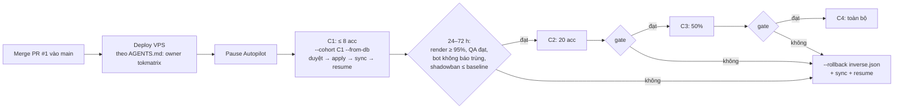
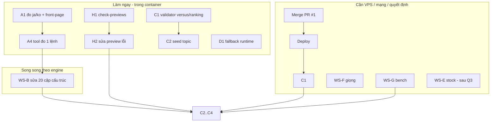

# Plan hoàn thiện Matrix Variant System V2

Ngày lập: 27/09/2026. Nhánh: `claude/variant-v2-master-plan`, tách từ PR #1 (`claude/matrix-variant-v2-3nx5cv`, commit `3c44168`).
Tài liệu kiến trúc gốc: `docs/MATRIX_VARIANT_SYSTEM_V2.md` (mục 1–27). Tài liệu này **không viết lại** kiến trúc đó. Nó đối chiếu
40 yêu cầu của brief kiến trúc với code thật và lập kế hoạch cho phần còn thiếu.

**Trạng thái PR #1:** A–I của brief đã làm: audit, plan V2, self-review (mục 22), Phase 0, Phase 1–6, và công cụ canary.
PR #1 đã merge vào `main` (27/09). Chưa deploy, chưa apply DNA cho kênh nào.

## 0. Tiến độ trên nhánh này (cập nhật 27/09)

| Việc | Trạng thái | Ghi chú |
|---|---|---|
| A2 tín hiệu `text` | ✅ | `creative_similarity/textgeom.py` (Chromium, lưới 9×16), test `tests/test_creative_similarity.py` |
| A3 tín hiệu `audio` | ✅ | chỉ mode `videos`; preview bỏ qua (tín hiệu thiếu ở một bên không tính vào composite) |
| A4 `tools/similarity-run.sh` | ✅ | chụp khung song song (`--jobs`) |
| A1 đo 5 ngôn ngữ + sinh lại conflicts | ⏳ | chạy sau khi H2 xanh (bố cục vừa đổi, KIT 7) |
| WS-B sửa cấu trúc vượt ngưỡng | ⏳ | sau A1 |
| C1 định dạng pack, C2 seed 132 × 10, C3 `same_subject` chéo pack/niche | ✅ | `topic_packs.fits_format`, `pick_pack_topic(since=…)` |
| D1 chuỗi fallback, D2 cache ảnh theo acc, D3 Antigravity đứng đầu | ✅ | `asset-manager.mjs`, `account-cache.mjs`, `meta.creative.asset_fallbacks` |
| H1 `tools/check-previews.mjs` | ✅ | hyperframes 0.7.58 như production |
| H2 mọi preview qua `hyperframes check` | 🟡 | xem mục 0.1 |
| H3 CI, H4 determinism | ✅ | `.github/workflows/matrix-variants.yml`, `tests/matrix-variants-determinism.test.mjs` |
| E stock video | 🟡 | `bkt_web/stock_video.py` + ledger chống trùng chéo provider, tắt mặc định (`TOKMATRIX_STOCK_VIDEO`); chuyển variant sang STOCK_VIDEO chờ Q3 + key |
| F giọng CapCut | 🔒 | container bị proxy chặn CapCut (403); chạy `tools/audition-voices.mjs --apply` trên máy có mạng |
| G bench | 🟡 | `deploy/bench_variants.sh` → `docs/creative_dna/bench-<ngày>.md`; cần chạy trên VPS (thử ở container: vox/data-card 31 s → 137 s render, RAM đỉnh 1.3 GB, 1.6 MB) |
| I canary | 🔒 | chủ repo duyệt plan dry-run, pause Autopilot, deploy |

### 0.1 H2: lỗi `hyperframes check`

Mốc: 118/608 preview (de+ja) lỗi. Phần lớn là báo giả của layout/contrast audit do cách kit dựng cảnh, sửa một lần trong kit (KIT 7):
clip-path còn sót sau reveal/transition, clip cũ còn hiện đúng khung chuyển cảnh, nhãn giữa header đặt thẳng lên ảnh, tem xoay 8°,
treatment overlay tràn khỏi khung ảnh, data-fit đo sai bề rộng flex item. Còn lại là lỗi thật từng engine (màu mực theo tone, ô chữ hẹp).
Chi tiết từng luật trong AGENTS.md (dòng "Variant QA tools").

## 1. Đối chiếu 40 yêu cầu với code

Ký hiệu: ✅ xong · 🟡 một phần · ❌ chưa có · 🔒 cần VPS, mạng hoặc quyết định của chủ repo.

| # | Yêu cầu | Trạng thái | Bằng chứng / chỗ thiếu | Workstream |
|---|---|---|---|---|
| 1 | Giữ 10 engine; kinetic không có variant; layout ≠ màu; GSAP paused, seek tất định, timing theo TTS | ✅ | `variants/schema.mjs` `ENGINES`; `kit/stage.mjs` timeline paused; test "deterministic HTML" từng engine | — |
| 2 | Creative DNA thay "1 acc = 1 variant" | ✅ | `variants/dna.mjs` (DNA v2), 75 base variant × 152 cấu trúc; 237/237 kênh được gán | — |
| 3 | Tách profile (content/visual/audio/renderer/compat/sample) | ✅ | `kit/define.mjs` `defineVariant` | — |
| 4 | Registry + API | ✅ | `variants/index.mjs`: `listVariants`, `getVariant`, `getVariantsForCountry`, `getVariantCreativeCapacity`, `validateRegistry`; `schema.mjs` `validateVariant` | — |
| 5 | Luật 4/6 thành code | ✅ | `compareVariantAxes`, `MIN_AXIS_DIFF_SAME_ENGINE`; test registry | — |
| 6 | Fingerprint đa tín hiệu | 🟡 | `bkt_web/creative_similarity`: layout, declared, visual, motion, color, asset, timing. **Thiếu:** text-geometry (renderer chỉ gắn `data-text-region` ở 2 chỗ) và audio/giọng (có trong `video_fingerprint` v1 nhưng chưa vào composite) | WS-A |
| 7 | 6–10 base × 2–4 composition, khác cấu trúc | ✅ | 7–10 variant/engine, phần lớn 2 composition; luật composition ≥ 2 trục | — |
| 8 | Gán DNA tất định, dry-run, apply transaction | ✅ | `bkt_web/autopilot/creative_dna.py`: max matching, `structure_conflicts.json`, `--cohort`, `--apply`/`--rollback` | — |
| 9 | Topic pack tách khỏi variant; validator compare/tierlist | 🟡 | 132 pack, `planner.pick_pack_topic`. **Thiếu:** topic Gemini viết cho pack `versus`/`ranking` không được kiểm định dạng ("A vs B" / "Ranking…"); 0 file seed `config/topics/packs/*.txt` | WS-C |
| 10 | Country theme, thứ tự merge rõ ràng, font offline | ✅ | `kit/resolve.mjs` (nơi duy nhất trộn tầng), `kit/fonts.mjs` @fontsource; font tiêu đề theo nước (mục 27) | — |
| 11 | Voice DNA, cache key đủ trường, FX tất định | 🟡🔒 | Cache key có text/voice/rate/pitch/provider/role/fx/clone; FX là chuỗi ffmpeg cố định; bỏ giọng `*_dsp`. **Thiếu:** chạy thử giọng CapCut (audition), model OpenVoice thật | WS-F |
| 12 | Stock video ledger V2 | ❌🔒 | Chưa có pipeline stock video nào; cần chọn provider và API key | WS-E |
| 13 | Mức tái dùng asset (GLOBAL…SCENE) | 🟡 | `assetProfile.scope` khai báo; `asset_ledger.py` chặn ảnh cảnh trùng giữa acc. **Thiếu:** cache theo scope ACCOUNT (compare A/B, reuse ảnh cùng subject) | WS-D |
| 14 | Antigravity là nguồn chính; fallback theo variant, không âm thầm | 🟡 | `assetProfile.fallback` chỉ được schema kiểm. **Thiếu:** runtime thực thi chuỗi fallback và ghi `meta.creative.asset_fallbacks` | WS-D |
| 15 | Nhãn AI `auto/on/off` | ✅ (conflict) | `TOKMATRIX_TIKTOK_AI_LABEL`, mặc định `off` theo chủ repo; conflict với "auto là mặc định" ghi ở V2 mục 2.1 | Quyết định Q2 |
| 16 | Performance budget | 🟡🔒 | `costProfile` + `list-variants cost`. **Thiếu:** số đo render s/video, CPU, RAM, disk trên VPS | WS-G |
| 17 | QA nhiều tầng | 🟡 | Static, HTML lint, determinism HTML, chữ dài, CJK: có test. **Thiếu:** `hyperframes check` chạy tự động (hiện chạy tay); CI không có (`.github/workflows` trống) | WS-H |
| 18 | Contact sheet ghi Creative DNA | ✅ | `tools/variant_contact_sheet.py` `label_lines` | — |
| 19–20 | Rollout theo phase, canary có rollback | 🟡🔒 | `--cohort C1..C4`, runbook V2 mục 25. **Chưa chạy** | WS-I |
| 21 | Multi-agent, freeze core | ✅ | V2 mục 16; AGENTS.md | — |
| 22 | Không copy-paste template | ✅ | Kit primitives + `design` dữ liệu; ~150 cấu trúc trong 10 thư mục engine | — |
| 23 | Tương thích ngược | ✅ | Test "legacy channels build exactly as before"; `MATRIX_VARIANTS=0` | — |
| 24 | Config versioning, transaction | ✅ | `apply_plan`: khoá, validate bản sao, backup, `os.replace`, `inverse.json` | — |
| 25 | Observability trong manifest | ✅ | `meta.json.creative` (variant, DNA, signature, axes, voice, versions, config_version) | — |
| 26 | Version DNA / renderer | ✅ | `DNA_VERSION` 2, `KIT_VERSION` 5, `renderer_version` | — |
| 27 | Không random không seed | ✅ | `kit/rng.mjs`; lint chặn `Math.random`/`Date.now` | — |
| 28 | Review 10 engine, báo concept trùng | ✅ | V2 mục 20; đo cross-engine ở mục 26 | — |
| 29 | Folklore bản địa hoá | ✅ | 8 variant (yokai, gwishin, nordic runestone…); giọng creepy thuộc DNA | — |
| 30 | Science khác thật về hình học | ✅ | 7 variant, không dùng khung hội thoại chung | — |
| 31 | Compare tách model/view | ✅ | `variants/compare/common.mjs` (dữ liệu so sánh) + 7 view | — |
| 32 | Survival: nhân vật gốc, không vẽ theo video | ✅ | `variants/survival/reactor.mjs` SVG tất định, 1 danh tính / (variant, nước) | — |
| 33 | Wildlife stock-first | ❌🔒 | Wildlife vẫn dùng ảnh AI | WS-E |
| 34–35 | Tài liệu V2 + Mermaid + self-review | ✅ | `docs/MATRIX_VARIANT_SYSTEM_V2.md` | — |
| 36–37 | Phase 0 + acceptance | ✅ | V2 mục 23 | — |
| 38–40 | Nguyên tắc, cấm, cách làm | ✅ | Ngưỡng 0.62 không nới; conflict ghi lại (mục 2.1, 27) | — |

### 1.1 Phát hiện mới sau khi code xong (chưa có trong brief)

1. **Gate similarity chưa đạt ở mức cấu trúc.** Có 20 cặp cấu trúc vượt 0.62 (V2 mục 26). Hiện được xử lý bằng cách gán tránh (không cặp nào
   chung một nước), chưa sửa tận gốc bố cục.
2. **Chưa đo:** ja/ko cross-engine, `newspaper/front-page` (vào sau khi merge nhánh bộ da).
3. **Hai cơ chế per-account song song.** `creative.variant_id` (V2) và `creative.skins` (bộ da, 80 kênh newspaper). Apply V2 bỏ bộ da
   của 80 kênh đó. Bộ da cho 54 acc DE dùng chung 3 layout, mà cùng cấu trúc khác DNA có composite trung bình 0.79.
4. **Lỗi `text_occluded` / `content_overlap`** chỉ lộ ra khi chạy `hyperframes check` thật trên preview. Test kit lint không bắt được
   (xem WS-H).

## 2. Quyết định cần chủ repo (chặn một số workstream)

| ID | Câu hỏi | Lựa chọn | Đề xuất | Chặn |
|---|---|---|---|---|
| Q1 | 80 kênh newspaper: giữ bộ da hay chuyển V2? | (a) apply V2 cho mọi kênh, bộ da bị thay · (b) loại 80 kênh khỏi plan V2, giữ bộ da · (c) giữ bộ da nhưng thêm luật "không 2 acc cùng nước chung cấu trúc" cho bộ da | (a) theo số liệu mục 26. Nếu vẫn muốn bộ da thì (c) | WS-I bậc C1 cho newspaper |
| Q2 | Nhãn AI mặc định | `off` (hiện tại) · `auto` (theo manifest: video có ảnh AI thì bật) | Giữ `off` tới khi có chính sách; code đã hỗ trợ `auto` | — |
| Q3 | Provider stock video | Pexels · Pixabay · cả hai | Pexels + Pixabay, ledger chống trùng chéo provider | WS-E |
| Q4 | Ngưỡng `dup_composite_threshold` | để trống · đặt sau C1–C2 | Đặt sau khi có ≥ 200 video thật đã đo composite | WS-I |
| Q5 | Bật CI (GitHub Actions) cho repo | có · không | Có: test Node + Python + `hyperframes check` preview mẫu | WS-H |

## 3. Workstream

Mỗi workstream có file sở hữu riêng để nhiều agent làm song song ít conflict (V2 mục 16). Core (`variants/kit/*`, `schema.mjs`,
`dna.mjs`, `index.mjs`, `creative_dna.py`) chỉ core owner sửa, qua proposal.

### WS-A. Similarity đầy đủ (core owner)

| Việc | File | Chấp nhận |
|---|---|---|
| A1. Đo ja/ko + `newspaper/front-page` + cặp cross-engine | chạy tool, không đổi code | `similarity.json` cho 5 ngôn ngữ; `structure_conflicts.json` sinh lại từ mọi report |
| A2. Tín hiệu `text_geometry`: kit gắn `data-text-region` cho mọi khối chữ (header, text, tag); signal lấy hộp chữ bằng trình duyệt ở 6 mốc thời gian | `kit/stage.mjs`, `kit/textstyles.mjs`, `bkt_web/creative_similarity/signals.py`, `tools/variant_contact_sheet.py` | Signal version 1, trọng số được hiệu chỉnh lại (tổng = 1); test so hai preview biết trước |
| A3. Tín hiệu `audio`: voice id + vân tay audio v1 + md5 BGM vào composite (video thật, không cho preview) | `creative_similarity/signals.py`, `__main__.py videos` | `videos` mode báo điểm audio; preview bỏ qua tín hiệu (không có audio thật) |
| A4. Tool `tools/similarity-run.sh`: build preview → chụp song song → đo → sinh conflicts, một lệnh | `compare_studio/tools/` | Chạy lại toàn bộ trong ≤ 60 phút trên 4 CPU |

### WS-B. Sửa bố cục các cấu trúc vượt ngưỡng (agent theo engine)

Thứ tự theo số cặp dính: `newspaper/microfilm#reader_screen` (3), `newspaper/court-sketch#sketch_pad` (3), `mystery/decoded#cipher_hex` (3),
`folklore/haunted-vhs#tape_play` (2), `mystery/cctv#single_monitor` (2), `vox/timeline-explainer#track_below` (2), rồi các cấu trúc còn lại
trong `structure_conflicts.json`.

- Mỗi agent chỉ sửa thư mục engine của mình. Mỗi lần sửa phải đo lại bằng A4, **không nới ngưỡng**.
- Đổi hình của variant thì tăng `version` của variant. DNA của kênh đã gán sẽ không còn khớp `variant_version` → `creative_dna`
  coi là kênh mới. Vì vậy **làm WS-B trước khi apply C2+** hoặc giữ version cũ cho kênh đã apply (xem rủi ro R3).
- Chấp nhận: số cặp trong `structure_conflicts.json` giảm từ 20 xuống ≤ 5; không test nào hỏng.

### WS-C. Topic pack chắc chắn (Python owner)

| Việc | File | Chấp nhận |
|---|---|---|
| C1. Validator định dạng: `versus` phải tách được 2 chủ thể (dùng lại luật `splitSubjects` của template-selector, port sang Python hoặc gọi Node); `ranking` phải có cấu trúc xếp hạng. Topic Gemini sai định dạng bị bỏ, không ghi vào kho | `bkt_web/autopilot/topics.py`, `topic_packs.py` | Test: topic sai định dạng bị loại; pack versus không bao giờ trả topic đơn chủ thể |
| C2. Seed 10–15 topic cho mỗi pack (132 file) để không phụ thuộc Gemini ở ngày đầu | `compare_studio/config/topics/packs/*.txt` | `validate_packs` báo pack thiếu seed; mọi seed qua C1 |
| C3. `same_subject` áp cả giữa topic pack và topic niche trong cùng nước | `planner.py` | Test hai acc cùng niche, khác pack không nhận cùng chủ thể trong `topic_subject_gap_days` |

### WS-D. Asset fallback + cache theo scope (core owner + adapter)

| Việc | File | Chấp nhận |
|---|---|---|
| D1. Runtime thực thi `assetProfile.fallback` theo thứ tự (`reuse_account_cache` → `stock` → `svg` → `text` → `existing_asset` → `fail`) khi ảnh Antigravity không có | `compare_studio/matrix/creative/asset-manager.mjs`, `compare_studio/matrix/qa/asset-qa.mjs`, `native-engine-adapter.mjs` | Ghi `meta.creative.asset_fallbacks: [{scene, from, to}]`; composition không đổi; chuỗi không có bước phù hợp → job lỗi |
| D2. Cache scope ACCOUNT: ảnh A/B compare theo chủ thể, ảnh cùng subject trong cùng acc | `bkt_web/asset_ledger.py` (thêm cột scope/subject_key) | Asset scope ACCOUNT không bao giờ ra acc khác (ledger chặn) |
| D3. Không bao giờ đổi provider ảnh; Antigravity vẫn đầu tiên | — | Test thứ tự provider không đổi |

### WS-E. Wildlife stock-first (sau Q3)

- `bkt_web/stock_video.py`: client Pexels/Pixabay (key trong key vault), chỉ nguồn có giấy phép, không TikTok/YouTube.
- Ledger V2 (`storage/stock_ledger.db`): `provider, provider_clip_id, canonical_url, content_sha256, perceptual_hash (5 khung), duration, license,
  author, assigned_accounts, used_segments`. Trước khi nhận clip: so pHash với toàn ledger để bắt cùng footage khác provider.
- Chỉ các variant có footage thật (savanna, deep-ocean, trail-cam, nature-doc, migration, field-guide) chuyển `assetProfile.type = STOCK_VIDEO` với
  fallback `IMAGE_AI`. prehistoric/extinct/microscope giữ ảnh AI.
- Chấp nhận: clip đã gán acc A bị từ chối cho acc B; clip trùng chéo provider bị phát hiện (test bằng 2 file cùng nội dung khác id).

### WS-F. Giọng (máy có mạng)

1. `node tools/audition-voices.mjs --langs de,en,ja,ko,vi --apply`, rồi commit `config/voices/capcut_auditioned.json`.
2. Nếu dùng clone: `pip install -r requirements-voice-clone.txt`, `python3 -m bkt_web.voice_clone setup`, enroll với `--consent`.
3. Chạy lại dry-run để Voice DNA dùng cả giọng CapCut đã qua audition.

### WS-G. Đo hiệu năng (VPS)

- Script `deploy/bench_variants.sh`: render 1 video mỗi engine × 2 variant bằng đúng `MATRIX_RENDER_SLOTS` hiện tại. Ghi render giây, CPU,
  RAM đỉnh, MB/video, số ảnh AI, giây TTS vào `docs/creative_dna/bench-<date>.md`.
- Chấp nhận: có số liệu cho 10 engine; so với legacy cùng engine. Không tăng `MATRIX_RENDER_SLOTS` nếu RAM đỉnh > 70% `MemoryHigh`.

### WS-H. QA tự động

| Việc | File | Chấp nhận |
|---|---|---|
| H1. `tools/check-previews.mjs`: build preview mọi cấu trúc × 5 ngôn ngữ × 2 DNA, chạy `hyperframes check` song song, báo lỗi theo cấu trúc | `compare_studio/tools/` | Lệnh trả mã ≠ 0 khi có preview lỗi; hiện kỳ vọng 0 lỗi |
| H2. Sửa mọi preview đang lỗi check (đã biết: `text_occluded`/`content_overlap` là loại lỗi kit lint không bắt) | thư mục engine | H1 xanh |
| H3. CI (sau Q5): Node test + Python test + H1 trên 1 ngôn ngữ mỗi engine | `.github/workflows/variants.yml` | CI xanh trên PR |
| H4. Determinism render: render 2 lần cùng input, so hash khung ở 0.2/0.5/0.8 | `compare_studio/tests/` (cần HyperFrames, đánh dấu slow) | Hash giống nhau |

### WS-I. Rollout production

- Trước C2: xong WS-B (tránh R3), H1 xanh, Q1 đã quyết.
- Sau C2: có composite thật từ dupguard → quyết Q4.
- Newspaper: làm theo Q1.

## 4. Thứ tự và phụ thuộc

| Đợt | Nội dung | Ai làm | Ước lượng |
|---|---|---|---|
| 1 | A1, A4, H1, H2, C1, C2, D1 | Claude (container) | 1–2 phiên |
| 2 | WS-B (song song 6 engine), A2, A3, D2, C3 | agent theo engine + core owner | 2–3 phiên |
| 3 | Merge, deploy, WS-F, WS-G, canary C1 | chủ repo trên VPS, Claude duyệt plan | 1–3 ngày |
| 4 | C2 → C4, Q4, WS-E | chủ repo + Claude | 1–2 tuần |

## 5. Rủi ro

| ID | Rủi ro | Giảm thiểu |
|---|---|---|
| R1 | Gate 0.62 trên preview không phản ánh video thật (ảnh thật khác placeholder) | A3 + dupguard composite trên video thật từ C1; Q4 chỉ đặt sau khi có số liệu |
| R2 | Apply V2 xoá bộ da 80 kênh newspaper | Plan ghi `drops_skins`; Q1 trước C1; `--rollback` |
| R3 | WS-B tăng `variant_version` → kênh đã apply mất DNA hợp lệ, bị gán lại | Làm WS-B trước C2; hoặc chỉ sửa khi variant chưa có kênh apply; test `_existing` giữ DNA khi version không đổi |
| R4 | Gemini viết topic sai định dạng cho pack versus/ranking → video compare "OPTION A / OPTION B" | C1 trước C1-canary cho kênh compare/tierlist |
| R5 | Không có CI → lỗi check chỉ lộ khi render thật | H1 bắt buộc trước mỗi merge vào variants/; H3 khi Q5 = có |
| R6 | Font offline thiếu glyph cho ký tự đặc biệt (★ ◎ ▲ ● hiện lùi sang font hệ thống) | Thêm họ symbol vào kit hoặc thay ký tự bằng SVG; kiểm trong H1 |
| R7 | Render cost variant cao hơn legacy | WS-G trước C3; không tăng slot khi chưa đo |

## 6. Rollback

- Code: `MATRIX_VARIANTS=0` tắt mọi variant và bộ da; kênh render legacy. Revert merge commit nếu cần.
- Config: `python3 -m bkt_web.autopilot.creative_dna --rollback <inverse.json>` cho từng bậc canary, rồi `sync_channel_configs`.
- Dupguard: `dup_composite_threshold` để trống = về hành vi chỉ theo khung.

## 7. Nghiệm thu toàn bộ

- 237 kênh có Creative DNA (hoặc bộ da theo Q1), không cặp cấu trúc nào trong `structure_conflicts.json` cùng nước.
- `structure_conflicts.json` ≤ 5 cặp; đo đủ 5 ngôn ngữ, 2 DNA mẫu.
- H1 xanh: mọi preview qua `hyperframes check`.
- Canary C4 xong; 72 h sau C4 bot không báo trùng; tỉ lệ render ≥ 95%.
- Số đo hiệu năng cho 10 engine trong `docs/creative_dna/bench-*.md`.
